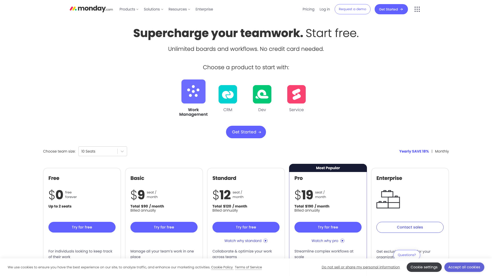
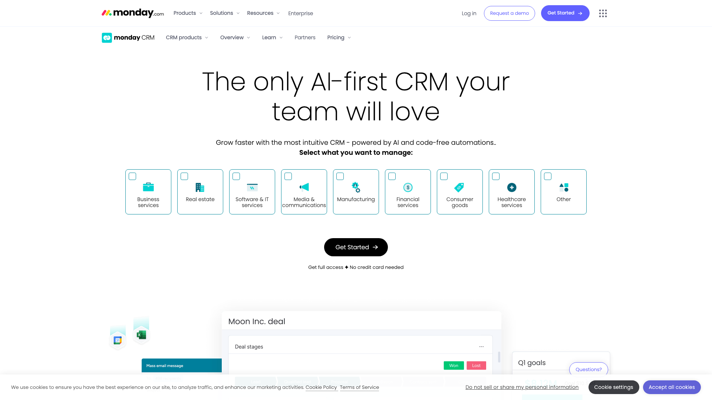
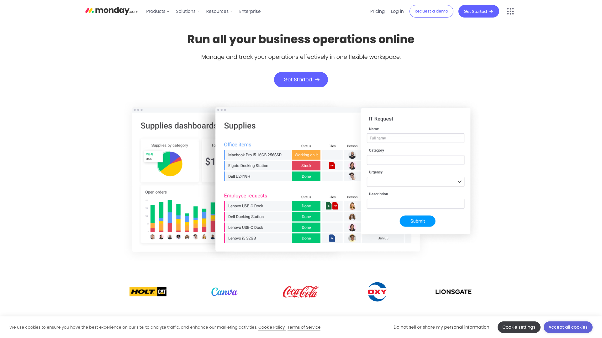
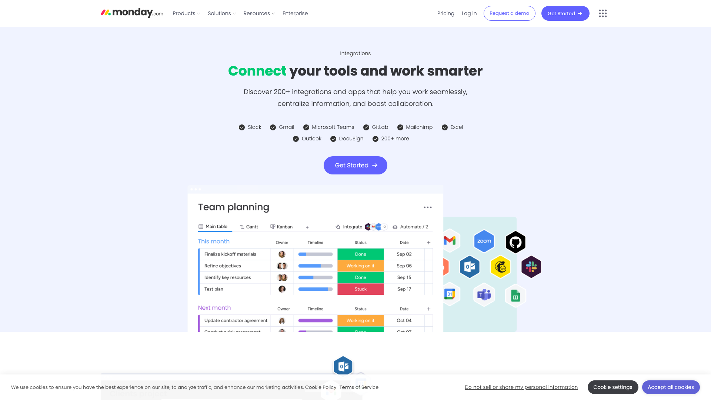
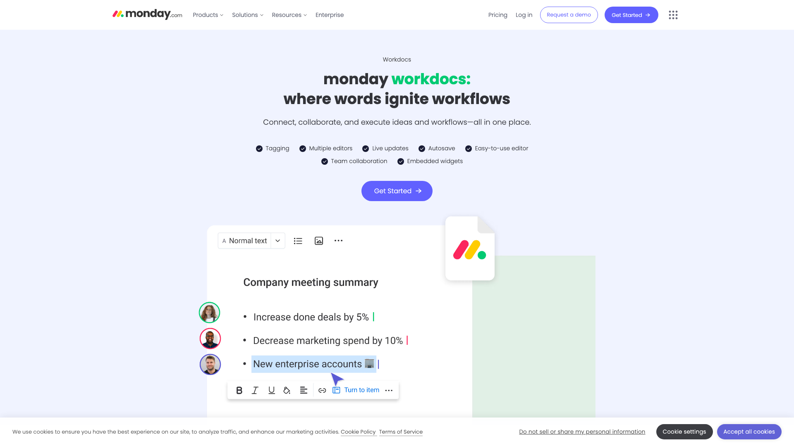
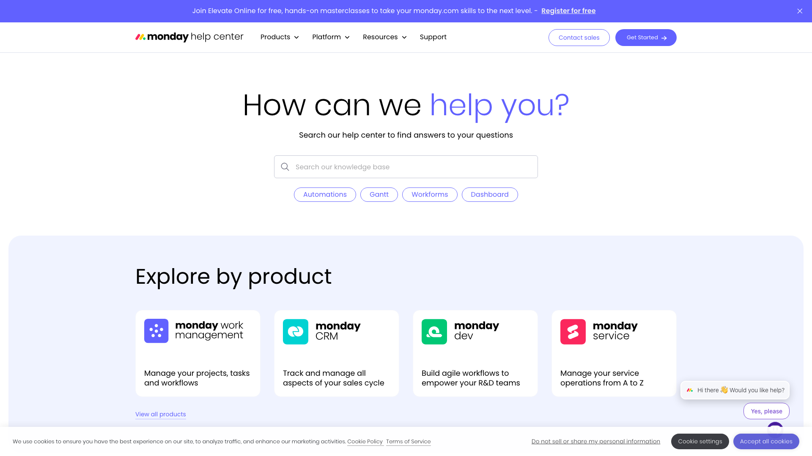

# 批量设计风格分析报告

> **分析时间**: 2025/12/3 21:47:00
> **页面数量**: 10

## 📸 分析页面预览

### 1. monday.com | The AI work platform
- **URL**: https://monday.com/


### 2. monday.com pricing and plans
- **URL**: https://monday.com/pricing



### 3. Do it faster with monday.com
- **URL**: https://monday.com/crm



### 4. Operations Management Software | monday.com
- **URL**: https://monday.com/operations



### 5. The Work OS for small to medium businesses | monday.com
- **URL**: https://monday.com/smb


### 6. Nonprofits | monday.com
- **URL**: https://monday.com/nonprofits


### 7. Construction Management Software | monday.com
- **URL**: https://monday.com/construction


### 8. Browse monday.com Integrations
- **URL**: https://monday.com/integrations



### 9. monday workdocs | monday.com
- **URL**: https://monday.com/workdocs



### 10. Support
- **URL**: https://support.monday.com/hc/en-us



---

# STYLEGUIDE.md

## 概览

### 设计语言总结
- **设计风格**：扁平化设计，注重简约和现代感。
- **技术栈**：使用 CSS Modules 和 CSS 变量。
- **主题机制**：通过 CSS 变量实现主题管理。
- **设计理念关键词**：简约、专业、科技感。

## 设计令牌

### 颜色系统（Color Tokens）
| 类别         | 变量名                 | 色值      | 用途说明               |
|--------------|------------------------|-----------|------------------------|
| 品牌主色     | --primary              | #333333   | 按钮、链接、强调       |
| 品牌辅色     | --secondary            | #F5F6F8   | 次要操作、标签         |
| 成功色       | --success              | #28a745   | 成功状态               |
| 警告色       | --warning              | #ffc107   | 警告状态               |
| 错误色       | --error                | #dc3545   | 错误状态               |
| 文本主色     | --text-primary         | #212529   | 标题、正文             |
| 文本次色     | --text-secondary       | #6c757d   | 描述、placeholder      |
| 文本禁用     | --text-disabled        | #ced4da   | 禁用状态               |
| 背景色       | --bg-primary           | #ffffff   | 页面背景               |
| 卡片背景     | --bg-card              | #f8f9fa   | 卡片、弹窗             |
| 边框色       | --border               | #dee2e6   | 分割线、边框           |

### 字体系统（Typography Tokens）
- **字体族**：`Poppins`, `sans-serif`
- **字号阶梯**：
  - xs: 12px
  - sm: 14px
  - base: 16px
  - lg: 18px
  - xl: 20px
  - 2xl: 24px
  - 3xl: 30px
  - 4xl: 36px
- **字重**：
  - light: 300
  - normal: 400
  - medium: 500
  - semibold: 600
  - bold: 700
- **行高**：
  - tight: 1.25
  - normal: 1.5
  - relaxed: 1.75
- **字间距**：正常

### 间距系统（Spacing Tokens）
- **基础单位**：8px 网格系统
- **间距阶梯**：
  - 0: 0px
  - 1: 4px
  - 2: 8px
  - 3: 12px
  - 4: 16px
  - 5: 20px
  - 6: 24px
  - 8: 32px
  - 10: 40px
  - 12: 48px
  - 16: 64px
  - 20: 80px
  - 24: 96px
- **容器内边距**：16px（移动端），24px（平板），32px（桌面）
- **组件间距**：标准

### 圆角系统（Border Radius Tokens）
- none: 0px
- sm: 4px
- md: 8px
- lg: 16px
- xl: 24px
- 2xl: 32px
- full: 9999px

### 阴影系统（Shadow Tokens）
- sm: 0 1px 2px rgba(0, 0, 0, 0.05)
- md: 0 4px 6px rgba(0, 0, 0, 0.1)
- lg: 0 10px 15px rgba(0, 0, 0, 0.15)
- xl: 0 20px 25px rgba(0, 0, 0, 0.2)
- 2xl: 0 25px 50px rgba(0, 0, 0, 0.25)

### 动效系统（Animation Tokens）
- **时长**：
  - fast: 150ms
  - normal: 300ms
  - slow: 500ms
- **缓动函数**：
  - ease-in: cubic-bezier(0.4, 0, 1, 1)
  - ease-out: cubic-bezier(0, 0, 0.2, 1)
  - ease-in-out: cubic-bezier(0.4, 0, 0.2, 1)
- **常用动画**：
  - fade: opacity 0.3s ease-in-out
  - slide: transform 0.3s ease-in-out
  - scale: transform 0.3s ease-in-out
  - bounce: transform 0.5s cubic-bezier(0.68, -0.55, 0.27, 1.55)

## 配色系统

### 语义化颜色映射
- **Primary**: --primary
- **Secondary**: --secondary
- **Success**: --success
- **Warning**: --warning
- **Error**: --error
- **Text Primary**: --text-primary
- **Text Secondary**: --text-secondary
- **Text Disabled**: --text-disabled
- **Background Primary**: --bg-primary
- **Card Background**: --bg-card
- **Border**: --border

## 排版系统

### 字体阶梯详细规格
- **Poppins**: 用于所有文本
- **字号**：从 12px 到 36px，适用于不同的文本层级
- **字重**：300 到 700，适用于不同的文本强调

## 间距系统

### 间距使用规范
- **基础单位**：8px
- **容器内边距**：根据设备类型调整
- **组件间距**：保持一致性，使用标准间距

## 组件库

### 按钮 Button

#### 设计规范
- **用途**：用于触发操作
- **变体**：primary, secondary, outline, ghost
- **尺寸**：sm, md, lg
- **状态**：default, hover, active, focus, disabled

#### 视觉规格
| 属性     | 值            |
|----------|---------------|
| 背景色   | #333333       |
| 文字色   | #ffffff       |
| 边框     | 1px solid #333333 |
| 圆角     | 8px           |
| 内边距   | 12px 24px     |
| 字号     | 16px          |
| 字重     | 500           |

#### Tailwind 类名
```css
btn-primary: "bg-[#333333] text-white px-6 py-3 rounded-lg font-medium hover:bg-[#444444] transition-colors"
```

#### React 组件代码
```tsx
import React from 'react';

interface ButtonProps {
  variant?: 'primary' | 'secondary' | 'outline' | 'ghost';
  size?: 'sm' | 'md' | 'lg';
  disabled?: boolean;
  onClick?: () => void;
}

const Button: React.FC<ButtonProps> = ({ variant = 'primary', size = 'md', disabled = false, onClick, children }) => {
  const baseClasses = 'font-medium transition-colors rounded-lg';
  const variantClasses = {
    primary: 'bg-[#333333] text-white hover:bg-[#444444]',
    secondary: 'bg-[#F5F6F8] text-[#333333] hover:bg-[#e2e6ea]',
    outline: 'border border-[#333333] text-[#333333] hover:bg-[#f8f9fa]',
    ghost: 'bg-transparent text-[#333333] hover:bg-[#f8f9fa]'
  };
  const sizeClasses = {
    sm: 'px-4 py-2 text-sm',
    md: 'px-6 py-3 text-base',
    lg: 'px-8 py-4 text-lg'
  };

  return (
    <button
      className={`${baseClasses} ${variantClasses[variant]} ${sizeClasses[size]} ${disabled ? 'opacity-50 cursor-not-allowed' : ''}`}
      onClick={onClick}
      disabled={disabled}
    >
      {children}
    </button>
  );
};

export default Button;
```

## 特效集合

### 阴影、渐变、动画
- **阴影**：使用不同层级的 box-shadow 提升层次感
- **渐变**：主要用于背景和按钮的 hover 效果
- **动画**：使用 CSS 动画提升交互体验

## 响应式规范

### 断点和自适应策略
- **断点**：576px, 768px, 992px, 1200px
- **策略**：使用媒体查询调整布局和组件尺寸

## 暗色模式

### 列出所有差异
- **背景色**：从 #ffffff 变为 #333333
- **文本色**：从 #212529 变为 #f8f9fa
- **边框色**：从 #dee2e6 变为 #444444

## 无障碍指南

### 对比度、焦点状态
- **对比度**：确保文本与背景的对比度达到 WCAG 标准
- **焦点状态**：为可交互元素提供明显的焦点样式

## 代码片段集

### 常用 Tailwind 组合
- `btn-primary`: `bg-[#333333] text-white px-6 py-3 rounded-lg font-medium hover:bg-[#444444] transition-colors`
- `btn-secondary`: `bg-[#F5F6F8] text-[#333333] px-6 py-3 rounded-lg font-medium hover:bg-[#e2e6ea] transition-colors`

## 最佳实践

### Do & Don't 对照表
- **Do**：使用一致的间距和排版
- **Don't**：避免使用过多不同的颜色和字体

通过以上设计系统文档，开发团队可以直接复刻该网站的视觉风格，确保一致性和可维护性。

---

*本报告由 Frontend Style Generator 批量脚本自动生成*
*生成时间: 2025/12/3 21:47:00*