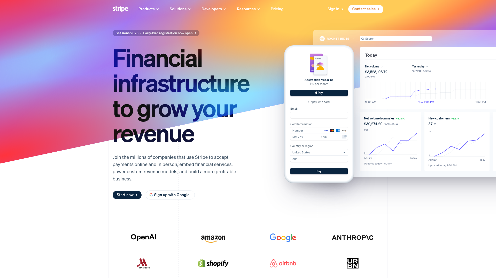
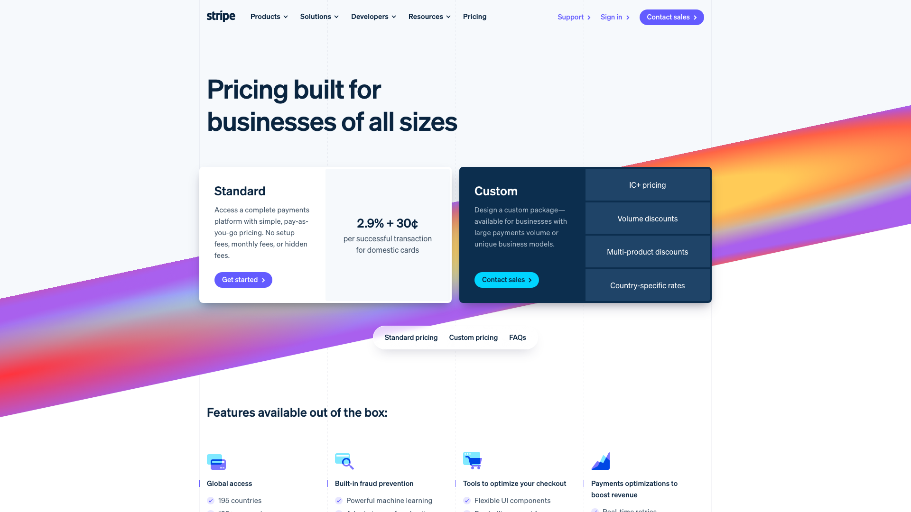
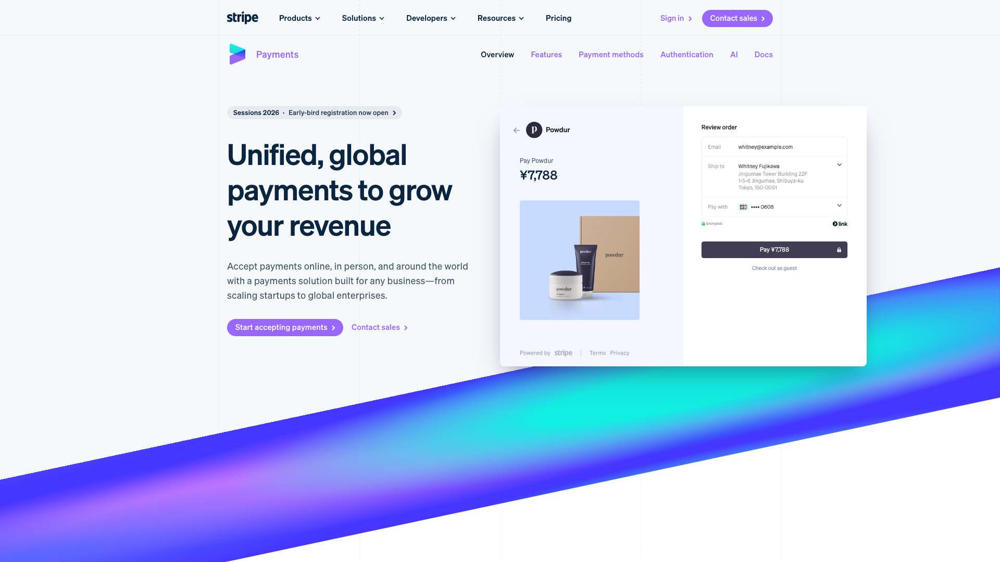
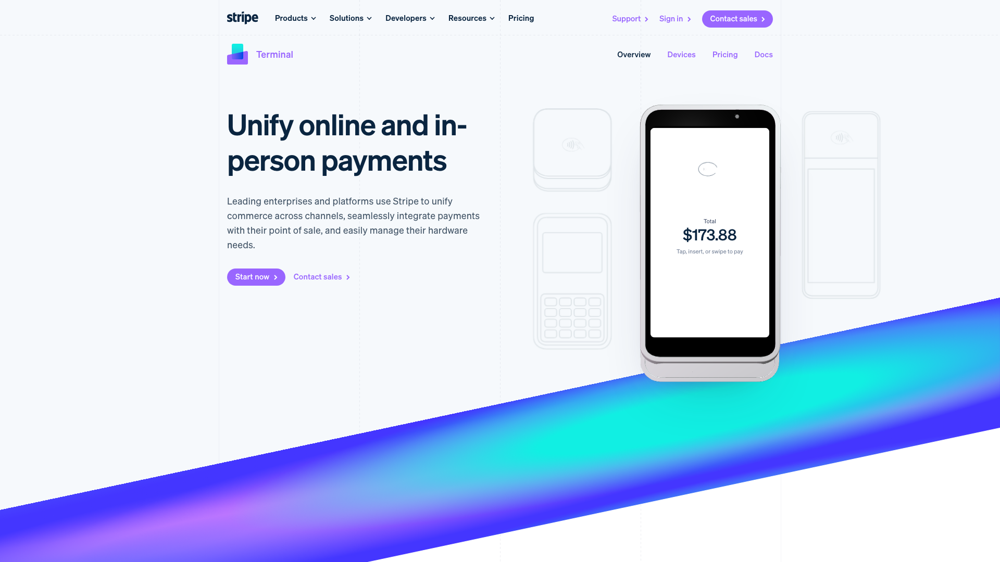
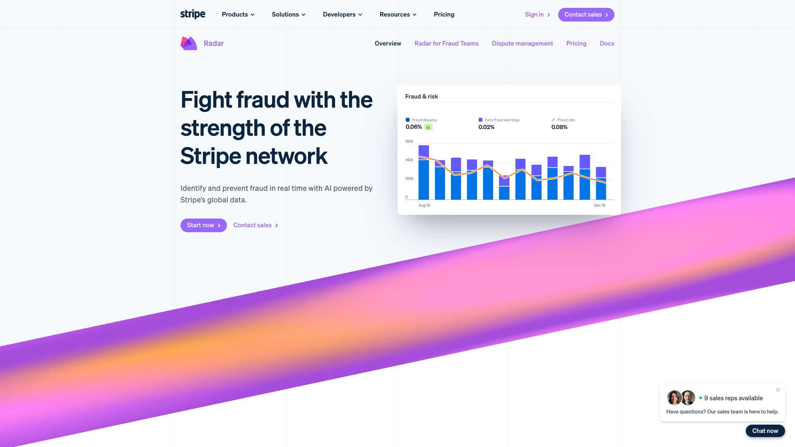
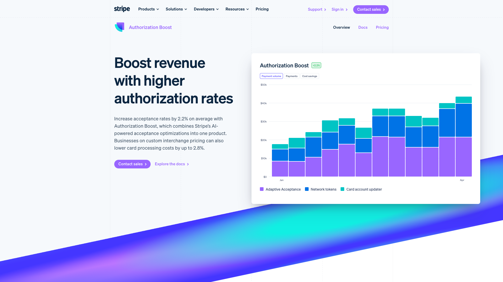
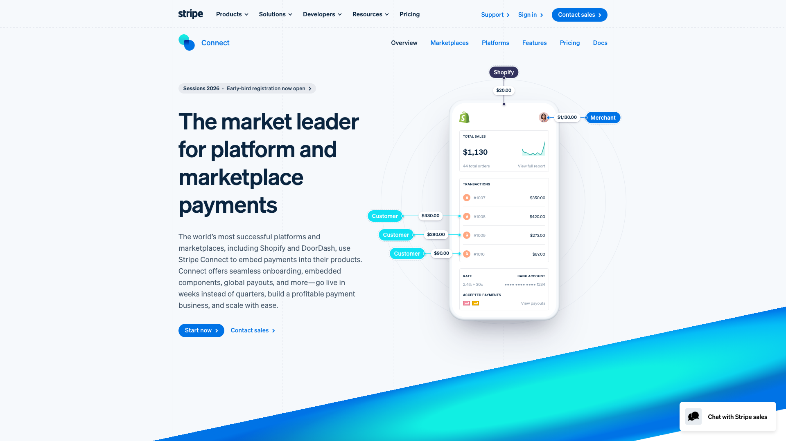
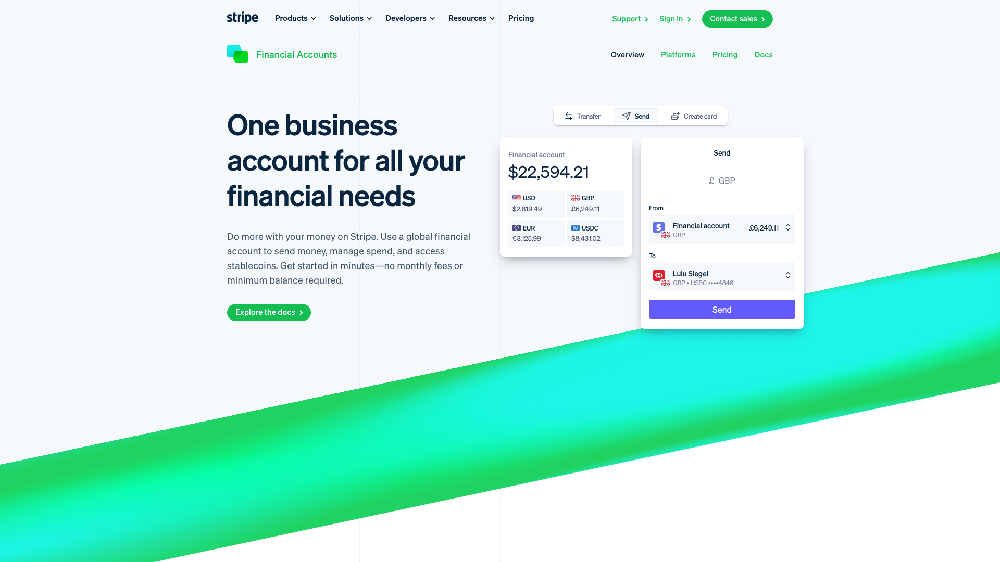
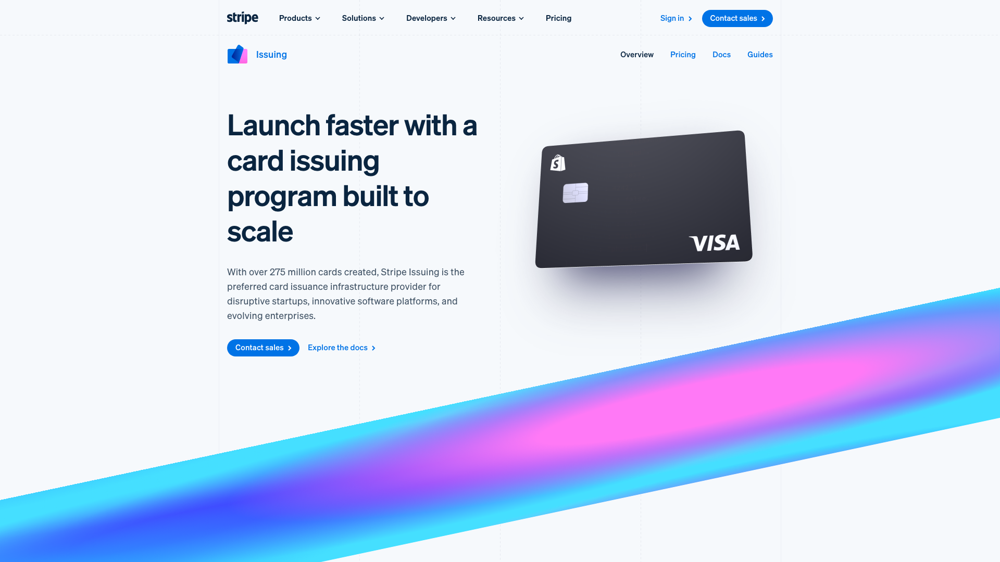
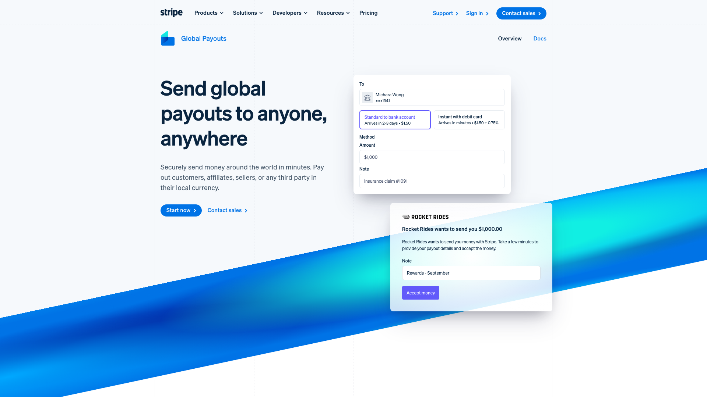

# 批量设计风格分析报告

> **分析时间**: 2025/12/3 22:04:26
> **页面数量**: 10

## 📸 分析页面预览

### 1. Stripe | Financial Infrastructure to Grow Your Revenue
- **URL**: https://stripe.com/



### 2. Pricing & Fees
- **URL**: https://stripe.com/pricing



### 3. Stripe Payments | Global Payment Processing Platform
- **URL**: https://stripe.com/payments



### 4. Stripe Terminal | Unified Commerce Platform
- **URL**: https://stripe.com/terminal



### 5. Stripe Radar | Payment and Credit Card Fraud Detection
- **URL**: https://stripe.com/radar



### 6. Stripe Authorization Boost | Increase Your Authorization Rates
- **URL**: https://stripe.com/authorization-boost



### 7. Stripe Connect | Platform and Marketplace Payment Solutions
- **URL**: https://stripe.com/connect



### 8. Stripe Financial Accounts | Business Accounts for Your Finances
- **URL**: https://stripe.com/financial-accounts



### 9. Stripe Issuing | Virtual and Physical Card Issuing Platform
- **URL**: https://stripe.com/issuing



### 10. Send global payouts and mass payments | Stripe Global Payouts
- **URL**: https://stripe.com/payouts



---

# Stripe Design System Style Guide

## 1. 概览

### 设计语言总结
- **设计风格**：扁平化设计，强调简约和专业。
- **技术栈**：使用 CSS 变量进行主题管理，部分页面可能使用了 JavaScript 控制的动态样式。
- **主题机制**：通过 CSS 变量进行主题管理，使用 `data` 属性和 `class` 切换实现不同状态的样式变化。
- **设计理念关键词**：简约、科技感、专业。

## 2. 设计令牌

### 颜色系统（Color Tokens）

| 类别       | 变量名           | 色值      | 用途说明               |
|------------|------------------|-----------|------------------------|
| 品牌主色   | --primary        | #635bff   | 按钮、链接、强调       |
| 品牌辅色   | --secondary      | #96f      | 次要操作、标签         |
| 成功色     | --success        | #28a745   | 成功状态               |
| 警告色     | --warning        | #ffc107   | 警告状态               |
| 错误色     | --error          | #dc3545   | 错误状态               |
| 文本主色   | --text-primary   | #0a2540   | 标题、正文             |
| 文本次色   | --text-secondary | #6c757d   | 描述、placeholder      |
| 文本禁用   | --text-disabled  | #adb5bd   | 禁用状态               |
| 背景色     | --bg-primary     | #ffffff   | 页面背景               |
| 卡片背景   | --bg-card        | #f8f9fa   | 卡片、弹窗             |
| 边框色     | --border         | #dee2e6   | 分割线、边框           |

### 字体系统（Typography Tokens）

- **字体族**：
  - 主字体：`-apple-system, BlinkMacSystemFont, "Segoe UI", Roboto, "Helvetica Neue", Arial, sans-serif`
  - 等宽字体：`"SFMono-Regular", Menlo, Monaco, Consolas, "Liberation Mono", "Courier New", monospace`

- **字号阶梯**：
  - xs: 12px
  - sm: 14px
  - base: 16px
  - lg: 18px
  - xl: 20px
  - 2xl: 24px
  - 3xl: 30px
  - 4xl: 36px

- **字重**：
  - light: 300
  - normal: 400
  - medium: 500
  - semibold: 600
  - bold: 700

- **行高**：
  - tight: 1.25
  - normal: 1.5
  - relaxed: 1.75

### 间距系统（Spacing Tokens）

- **基础单位**：4px 网格系统
- **间距阶梯**：
  - 0: 0px
  - 1: 4px
  - 2: 8px
  - 3: 12px
  - 4: 16px
  - 5: 20px
  - 6: 24px
  - 8: 32px
  - 10: 40px
  - 12: 48px
  - 16: 64px
  - 20: 80px
  - 24: 96px

### 圆角系统（Border Radius Tokens）

- none: 0px
- sm: 2px
- md: 4px
- lg: 8px
- xl: 16px
- 2xl: 24px
- full: 9999px

### 阴影系统（Shadow Tokens）

- sm: `0 1px 2px rgba(0, 0, 0, 0.05)`
- md: `0 4px 6px rgba(0, 0, 0, 0.1)`
- lg: `0 10px 15px rgba(0, 0, 0, 0.1)`
- xl: `0 20px 25px rgba(0, 0, 0, 0.1)`
- 2xl: `0 25px 50px rgba(0, 0, 0, 0.25)`

### 动效系统（Animation Tokens）

- **时长**：
  - fast: 150ms
  - normal: 300ms
  - slow: 500ms

- **缓动函数**：
  - ease-in: `cubic-bezier(0.4, 0, 1, 1)`
  - ease-out: `cubic-bezier(0, 0, 0.2, 1)`
  - ease-in-out: `cubic-bezier(0.4, 0, 0.2, 1)`

- **常用动画**：
  - fade: `opacity`
  - slide: `transform`
  - scale: `transform`
  - bounce: `transform`

## 3. 配色系统

### 语义化颜色映射
- **背景**：`--bg-primary` 用于整体页面背景
- **文本**：`--text-primary` 用于主要文本，`--text-secondary` 用于次要文本
- **按钮**：`--primary` 用于主要按钮背景，`--secondary` 用于次要按钮背景

## 4. 排版系统

详细规格如上所述，确保所有文本元素使用一致的字体族和字号阶梯。

## 5. 间距系统

所有组件和布局均应遵循 4px 网格系统，确保一致的视觉间距。

## 6. 组件库

### 按钮 Button

#### 设计规范
- **用途**：用于触发操作或提交表单
- **变体**：primary, secondary, outline, ghost
- **尺寸**：sm, md, lg
- **状态**：default, hover, active, focus, disabled

#### 视觉规格
| 属性     | 值         |
|----------|------------|
| 背景色   | #635bff    |
| 文字色   | #ffffff    |
| 边框     | 1px solid #635bff |
| 圆角     | 8px        |
| 内边距   | 12px 24px  |
| 字号     | 16px       |
| 字重     | 500        |

#### Tailwind 类名
```css
btn-primary: "bg-[#635bff] text-white px-6 py-3 rounded-lg font-medium hover:bg-[#4a4aff] transition-colors"
```

#### React 组件代码
```tsx
import React from 'react';

type ButtonProps = {
  variant: 'primary' | 'secondary' | 'outline' | 'ghost';
  size: 'sm' | 'md' | 'lg';
  disabled?: boolean;
  onClick?: () => void;
};

const Button: React.FC<ButtonProps> = ({ variant, size, disabled, onClick, children }) => {
  const baseClasses = 'font-medium rounded-lg transition-colors';
  const variantClasses = {
    primary: 'bg-[#635bff] text-white hover:bg-[#4a4aff]',
    secondary: 'bg-[#96f] text-white hover:bg-[#7a7aff]',
    outline: 'border border-[#635bff] text-[#635bff] hover:bg-[#f0f0ff]',
    ghost: 'bg-transparent text-[#635bff] hover:bg-[#f0f0ff]',
  };
  const sizeClasses = {
    sm: 'px-4 py-2 text-sm',
    md: 'px-6 py-3 text-base',
    lg: 'px-8 py-4 text-lg',
  };

  return (
    <button
      className={`${baseClasses} ${variantClasses[variant]} ${sizeClasses[size]}`}
      disabled={disabled}
      onClick={onClick}
    >
      {children}
    </button>
  );
};

export default Button;
```

## 7. 特效集合

### 阴影、渐变、动画
- **阴影**：使用 `box-shadow` 令牌
- **渐变**：如有使用，确保方向和色标一致
- **动画**：使用 `transition` 和 `animation` 令牌

## 8. 响应式规范

### 断点和自适应策略
- **断点**：
  - 小屏幕：max-width: 599px
  - 中屏幕：600px - 899px
  - 大屏幕：900px 及以上

- **自适应策略**：使用 CSS Flexbox 和 Grid 布局，确保在不同屏幕尺寸下的内容一致性。

## 9. 暗色模式

如支持暗色模式，需列出所有颜色和背景的差异，确保对比度和可读性。

## 10. 无障碍指南

### 对比度、焦点状态
- **对比度**：确保文本与背景的对比度符合 WCAG 2.1 AA 标准。
- **焦点状态**：使用明显的焦点样式，如 `box-shadow` 或 `outline`。

## 11. 代码片段集

### 常用 Tailwind 组合
```css
.flex-center: "flex justify-center items-center"
.text-primary: "text-[#0a2540]"
.bg-secondary: "bg-[#96f]"
```

## 12. 最佳实践

### Do & Don't 对照表
- **Do**：使用一致的间距和排版，确保视觉一致性。
- **Don't**：避免使用不符合设计令牌的自定义颜色和字体。

通过以上详细的设计系统文档，开发团队可以确保在不同页面和组件中保持一致的视觉风格和用户体验。

---

*本报告由 Frontend Style Generator 批量脚本自动生成*
*生成时间: 2025/12/3 22:04:26*