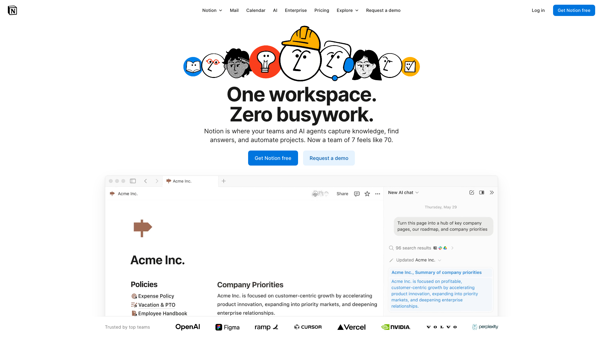
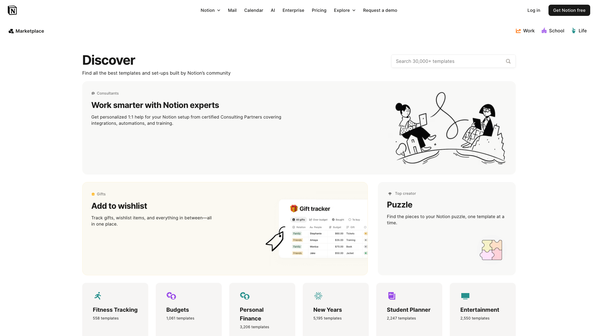
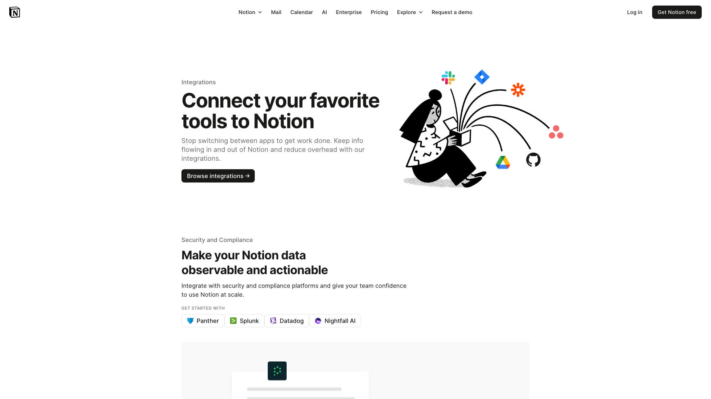
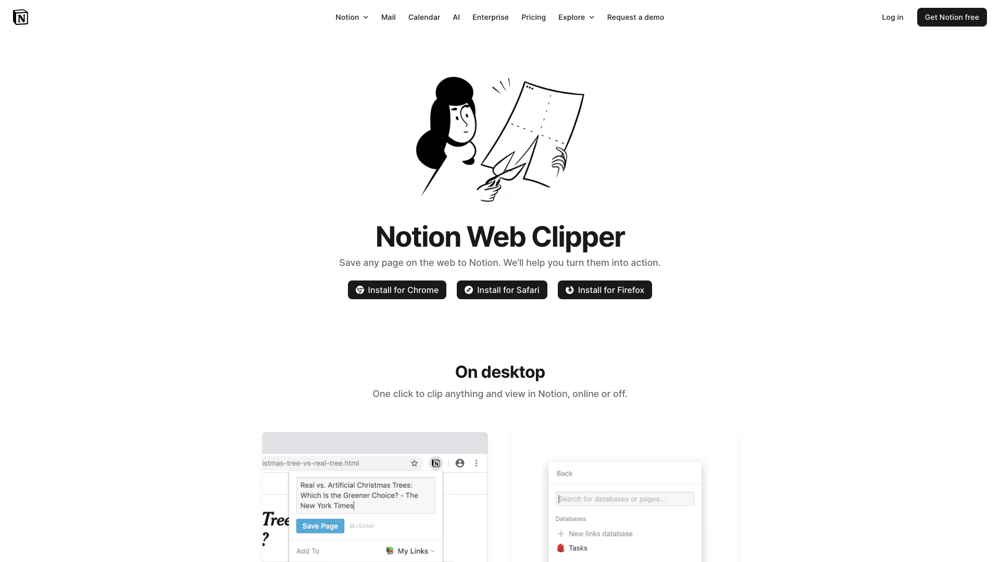
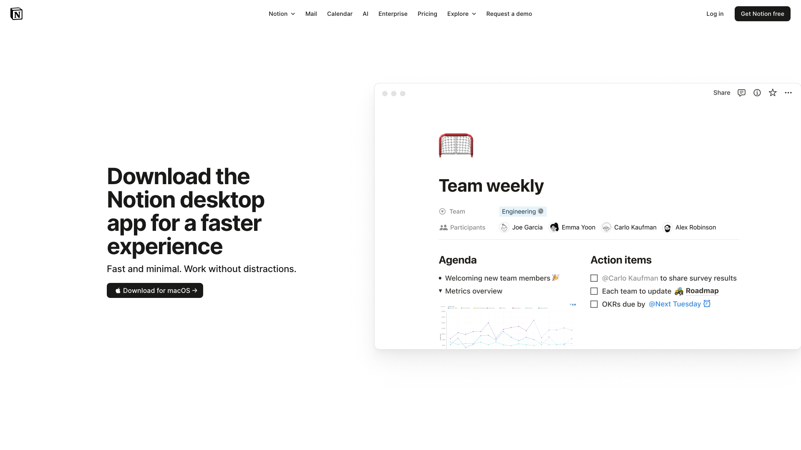
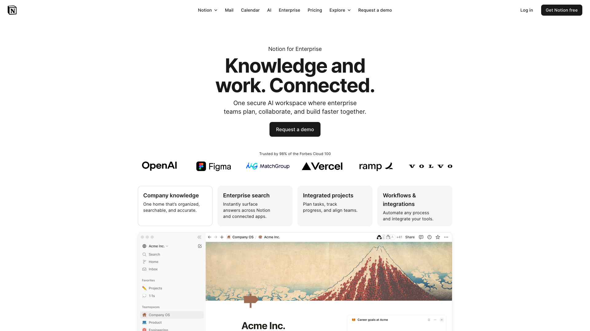
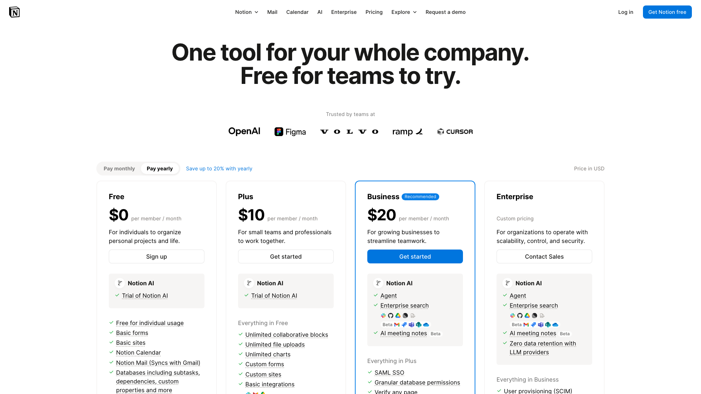
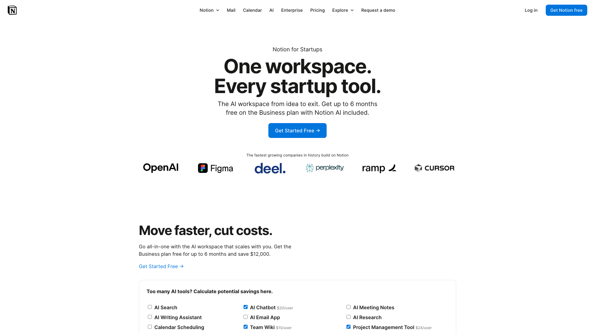
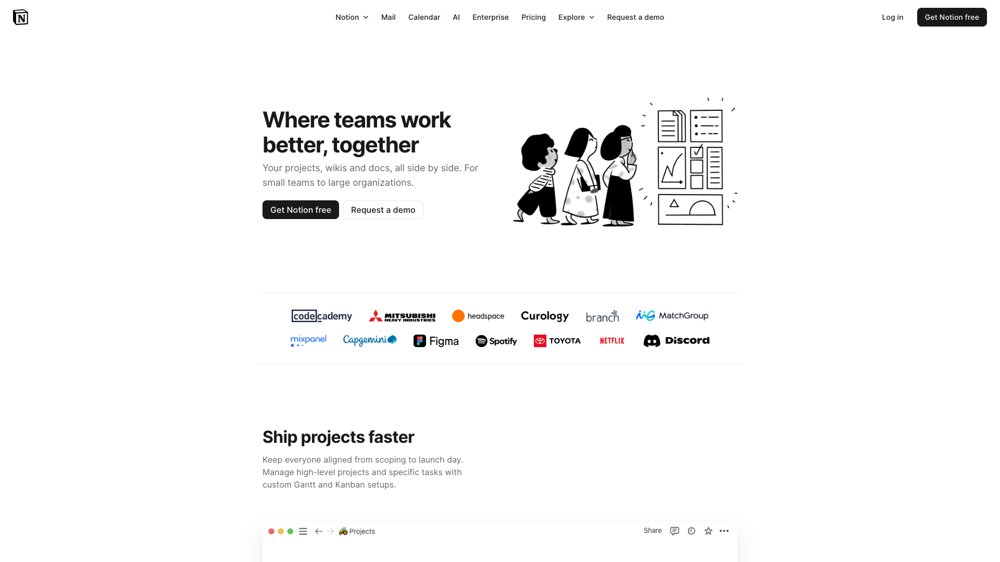

# 批量设计风格分析报告

> **分析时间**: 2025/12/3 21:31:15
> **页面数量**: 10

## 📸 分析页面预览

### 1. The AI workspace that works for you. | Notion
- **URL**: https://www.notion.com/



### 2. The AI workspace that works for you. | Notion
- **URL**: https://www.notion.com/product


### 3. Choose from 30,000+ Notion templates | Notion Marketplace
- **URL**: https://www.notion.com/templates



### 4. Integrations – Notion
- **URL**: https://www.notion.com/integrations



### 5. Notion Web Clipper for Chrome, Safari, Firefox, and mobile
- **URL**: https://www.notion.com/web-clipper



### 6. Notion Desktop App for Mac & Windows | Notion
- **URL**: https://www.notion.com/download



### 7. Notion for Enterprise
- **URL**: https://www.notion.com/enterprise



### 8. Notion Pricing Plans: Free, Plus, Business, & Enterprise.
- **URL**: https://www.notion.com/pricing



### 9. Your connected workspace for wiki, docs & projects | Notion
- **URL**: https://www.notion.com/startups



### 10. Notion for Teams and Businesses
- **URL**: https://www.notion.com/teams



---

# STYLEGUIDE.md

## 1. 概览

### 设计语言总结
- **设计风格**：扁平化设计，注重简约和功能性。
- **技术栈**：使用了 CSS 和内联样式，可能结合了 CSS Modules 或 Styled Components。
- **主题机制**：通过 CSS 类名切换（如 `blue_theme__VG1s8` 和 `base_theme__FJXCL`）实现主题变化。
- **设计理念关键词**：简约、专业、科技感。

## 2. 设计令牌

### 颜色系统（Color Tokens）
| 类别 | 变量名 | 色值 | 用途说明 |
|------|--------|------|----------|
| 品牌主色 | --primary | #1a73e8 | 按钮、链接、强调 |
| 文本主色 | --text-primary | #202124 | 标题、正文 |
| 文本次色 | --text-secondary | #3c4043 | 描述、placeholder |
| 背景色 | --bg-primary | #ffffff | 页面背景 |
| 边框色 | --border | #dadce0 | 分割线、边框 |

### 字体系统（Typography Tokens）
- **字体族**：`"Roboto-Regular", arial, sans-serif`
- **字号阶梯**：
  - xs: 11px
  - sm: 12px
  - base: 14px
  - lg: 16px
  - xl: 20px
- **字重**：
  - normal: 400
  - medium: 500
- **行高**：1.5
- **字间距**：正常

### 间距系统（Spacing Tokens）
- **基础单位**：4px 网格系统
- **间距阶梯**：0, 4, 8, 12, 16, 20, 24, 32, 40, 48, 56, 64
- **容器内边距**：16px（移动端），24px（平板），32px（桌面）
- **组件间距**：标准

### 圆角系统（Border Radius Tokens）
- none: 0px
- sm: 4px
- md: 8px
- lg: 16px
- full: 50%

### 阴影系统（Shadow Tokens）
- sm: `0 1px 3px rgba(0, 0, 0, 0.12)`
- md: `0 4px 6px rgba(0, 0, 0, 0.1)`
- lg: `0 10px 15px rgba(0, 0, 0, 0.1)`

### 动效系统（Animation Tokens）
- **时长**：
  - fast: 150ms
  - normal: 300ms
  - slow: 450ms
- **缓动函数**：
  - ease-in-out: `cubic-bezier(0.4, 0, 0.2, 1)`

## 3. 配色系统

### 语义化颜色映射
- **按钮主色**：--primary
- **文本颜色**：--text-primary, --text-secondary
- **背景颜色**：--bg-primary

## 4. 排版系统

### 字体阶梯详细规格
- **主字体**：`"Roboto-Regular", arial, sans-serif`
- **等宽字体**：`"Courier New", monospace`
- **装饰字体**：无

## 5. 间距系统

### 间距使用规范
- **基础单位**：4px
- **容器内边距**：16px 至 32px
- **组件间距**：标准为 16px

## 6. 组件库

### 按钮 Button

#### 设计规范
- **用途**：用于提交表单、触发事件
- **变体**：primary, secondary
- **尺寸**：sm, md, lg
- **状态**：default, hover, active, focus, disabled

#### 视觉规格
| 属性 | 值 |
|------|-----|
| 背景色 | #1a73e8 |
| 文字色 | #ffffff |
| 边框 | 1px solid #dadce0 |
| 圆角 | 4px |
| 内边距 | 12px 24px |
| 字号 | 14px |
| 字重 | 500 |

#### Tailwind 类名
```css
btn-primary: "bg-[#1a73e8] text-white px-6 py-3 rounded-md font-medium hover:bg-[#1558b0] transition-colors"
```

#### React 组件代码
```tsx
import React from 'react';

const Button = ({ children, onClick }) => (
  <button className="bg-[#1a73e8] text-white px-6 py-3 rounded-md font-medium hover:bg-[#1558b0] transition-colors" onClick={onClick}>
    {children}
  </button>
);

export default Button;
```

## 7. 特效集合

### 阴影、渐变、动画
- **阴影**：使用 `box-shadow` 提供深度感
- **渐变**：主要用于背景和按钮悬停效果
- **动画**：使用 `transition` 和 `animation` 提供交互反馈

## 8. 响应式规范

### 断点和自适应策略
- **移动端**：max-width: 767px
- **平板**：768px - 1023px
- **桌面**：min-width: 1024px

## 9. 暗色模式

### 差异
- **背景色**：#202124
- **文本色**：#e8eaed

## 10. 无障碍指南

### 对比度、焦点状态
- **对比度**：确保文本与背景的对比度至少为 4.5:1
- **焦点状态**：使用明显的边框或阴影

## 11. 代码片段集

### 常用 Tailwind 组合
- **按钮**：`btn-primary`
- **卡片**：`shadow-md rounded-lg p-4`

## 12. 最佳实践

### Do & Don't 对照表
- **Do**：使用一致的颜色和字体
- **Don't**：避免使用过多的阴影和渐变

---

通过以上设计系统文档，开发团队可以准确复刻网站的视觉风格，确保一致性和可维护性。

---

*本报告由 Frontend Style Generator 批量脚本自动生成*
*生成时间: 2025/12/3 21:31:15*