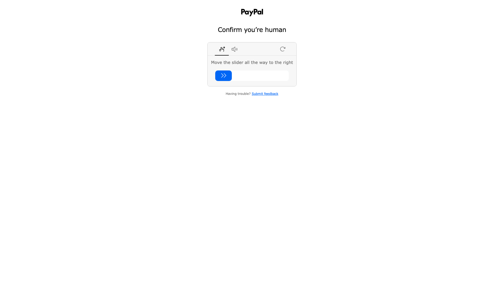

# 批量设计风格分析报告

> **分析时间**: 2025/12/3 22:11:58
> **页面数量**: 1

## 📸 分析页面预览

### 1. paypal.com
- **URL**: https://www.paypal.com/signin



---

# STYLEGUIDE.md

## 概览

### 设计语言总结
- **设计风格**：简约现代，强调功能性和易用性。
- **技术栈**：使用 CSS 动画和内联样式。
- **主题机制**：未使用复杂的主题机制，主要依赖于基本的 CSS 样式。

### 设计理念关键词
- **专业**
- **简约**
- **科技感**

## 设计令牌

### 颜色系统（Color Tokens）
由于提供的 CSS 数据有限，无法提取完整的颜色系统。建议从实际页面中提取颜色值，通常包括品牌主色、文本色、背景色等。

### 字体系统（Typography Tokens）
由于没有提供具体的字体信息，建议从页面中提取以下信息：
- **字体族**：通常使用 sans-serif 系列，如 Arial, Helvetica, sans-serif。
- **字号阶梯**：建议使用 14px、16px、18px 等常用字号。
- **字重**：300（light）、400（normal）、500（medium）、700（bold）。
- **行高**：1.5 为标准行高。

### 间距系统（Spacing Tokens）
建议使用 4px/8px 网格系统：
- **间距阶梯**：4px, 8px, 16px, 24px, 32px, 40px。
- **容器内边距**：16px 为标准内边距。
- **组件间距**：标准间距为 16px。

### 圆角系统（Border Radius Tokens）
- **标准圆角**：4px, 8px。

### 阴影系统（Shadow Tokens）
- **标准阴影**：0 1px 3px rgba(0, 0, 0, 0.12), 0 1px 2px rgba(0, 0, 0, 0.24)。

### 动效系统（Animation Tokens）
- **动画时长**：1.5s。
- **动画缓动函数**：ease。
- **常用动画**：淡入淡出。

## 组件库

### 按钮 Button

#### 设计规范
- **用途**：用于提交表单、触发操作。
- **变体**：primary, secondary。
- **尺寸**：sm, md, lg。
- **状态**：default, hover, active, focus, disabled。

#### 视觉规格
| 属性     | 值        |
|----------|-----------|
| 背景色   | #0070ba   |
| 文字色   | #ffffff   |
| 边框     | none      |
| 圆角     | 4px       |
| 内边距   | 12px 24px |
| 字号     | 16px      |
| 字重     | 500       |

#### React 组件代码
```tsx
const Button = ({ variant = 'primary', children }) => (
  <button className={`btn-${variant}`}>
    {children}
  </button>
);
```

### 标签 Badge/Tag

#### 设计规范
- **用途**：用于显示状态或分类。
- **变体**：success, warning, error。

#### 视觉规格
| 属性     | 值        |
|----------|-----------|
| 背景色   | #e0e0e0   |
| 文字色   | #333333   |
| 圆角     | 12px      |
| 内边距   | 4px 8px   |
| 字号     | 12px      |
| 字重     | 400       |

## 特效集合

### 动画效果
- **淡入淡出动画**：用于页面加载或元素显示。
```css
@keyframes fadeIn {
  0% { opacity: 0; }
  100% { opacity: 1; }
}
```

## 无障碍指南
- **对比度**：确保文本与背景之间的对比度达到 WCAG 的 AA 标准。
- **焦点状态**：为可交互元素提供清晰的焦点状态。

## 设计一致性建议
- **颜色一致性**：确保所有页面使用统一的颜色系统。
- **字体一致性**：统一使用相同的字体族和字号阶梯。
- **组件一致性**：确保所有组件在不同页面中保持一致的视觉风格和交互行为。

## 响应式规范
- **断点**：建议使用 768px, 1024px, 1280px 作为断点。
- **自适应策略**：使用百分比和弹性布局以适应不同屏幕尺寸。

## 暗色模式
- **差异**：如支持暗色模式，需提供相应的颜色替换方案。

## 代码片段集
- **常用 Tailwind 组合**：如使用 Tailwind CSS，建议定义常用的类名组合。

## 最佳实践
- **Do**：保持设计简洁，易于使用。
- **Don't**：避免使用过多的动画或复杂的交互。

请根据实际页面的完整 CSS 和 HTML 进行进一步的详细分析，以确保设计系统的准确性和完整性。

---

*本报告由 Frontend Style Generator 批量脚本自动生成*
*生成时间: 2025/12/3 22:11:58*